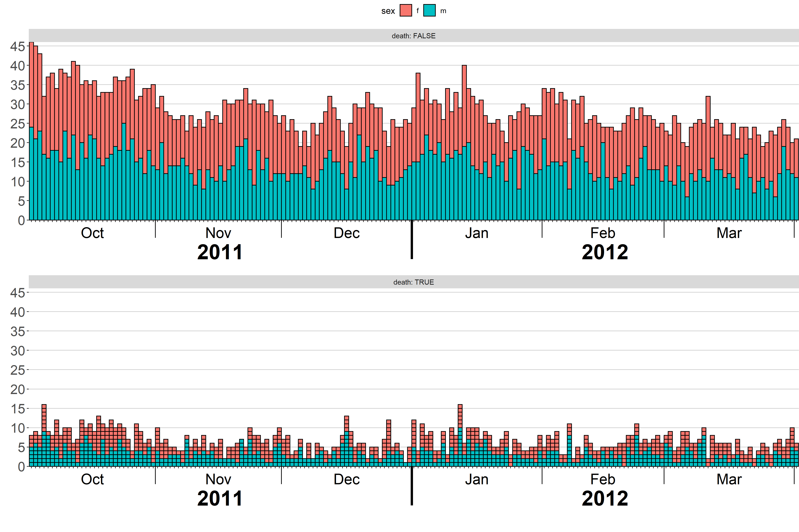

ggepicurve
================

plotting epicurves with **ggplot2**

## Install

``` r
devtools::install_github("martin-borkovec/ggepicurve@ggplot-3-2-1", 
                         build_vignettes = TRUE)
```

## Tutorial

Make sure to checkout the vignette.

``` r
vignette("ggepicurve", package = "ggepicurve")
```

## Bugs and Feature Requests

Don’t hesitate to post any problems, questions or suggestions in the
issues section of this project.

## Example

``` r
library(ggepicurve)

dat <- ggepicurve::sim_data
dat <- dat[dat$date <= as.Date("2012-04-01") & dat$date > as.Date("2011-10-01"),]

# initialize plot
ggepicurve(data = dat,
           mapping = aes(fill = sex), # set mapping of geom col
           date = "date", 
           epi_blocks = 25) + # draw each case as a block if max daily cases of panel are under 25
  # add annotations for months
  annotation_date(date_unit = "month", 
                  format = "%b",
                  y_percentage = 0.1,
                  text_par = list(size = 7)) +
   # add annotations for years
  annotation_date(date_unit = "year",
                  format = "%Y",
                  y_percentage = 0.22,
                  extra_lines = 5,
                  text_par = list(fontface = "bold", size = 10),
                  line_par = list(size = 1.5)) +
  # facet plot by death status
  facet_wrap(facets = "death",
             nrow = 2,
             labeller = label_both) + 
  # adjust some theme elements
  theme(axis.text.x = element_blank(), 
        axis.text.y = element_text(size = 18),
        strip.text = element_text(size = 18),
        legend.title = element_text(size = 18),
        legend.text = element_text(size = 18))
```

<!-- -->
